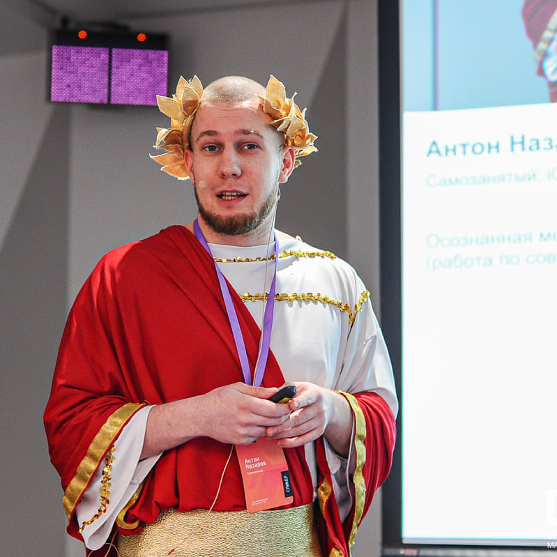
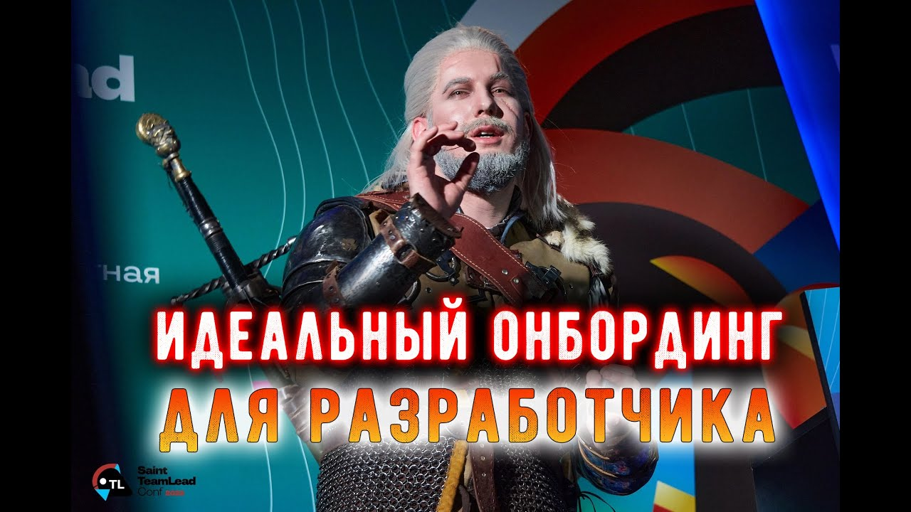
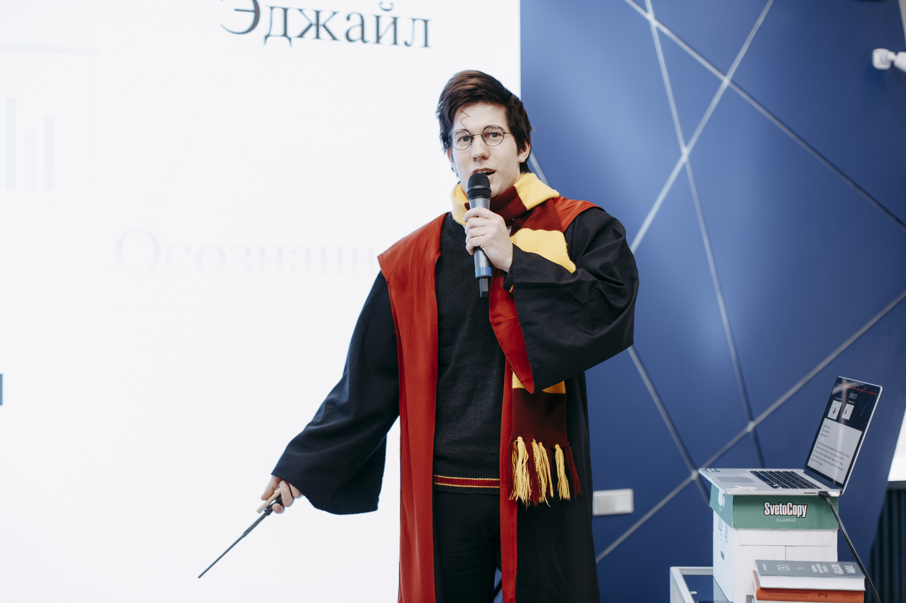
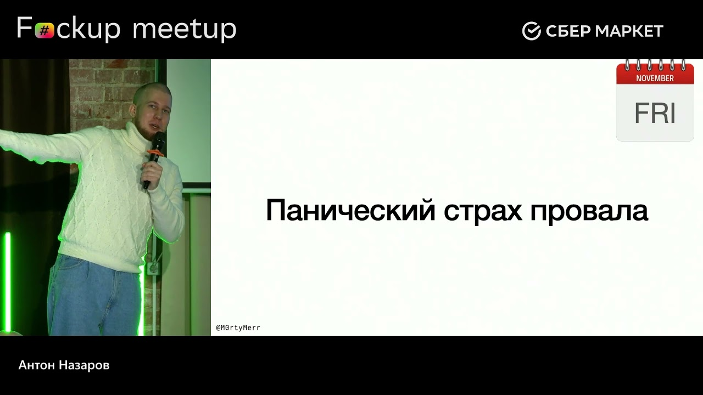
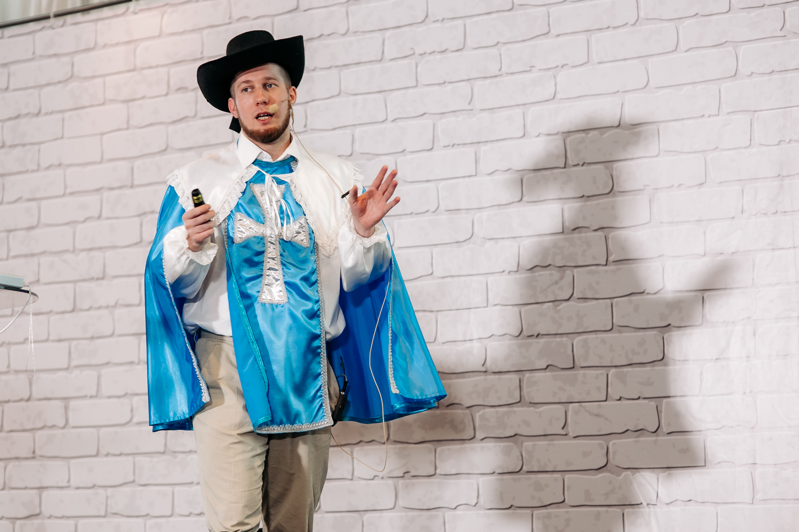
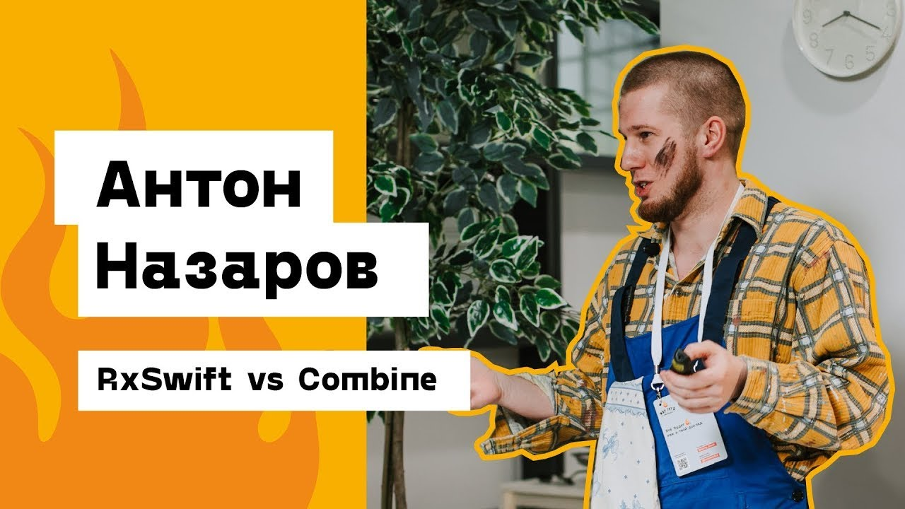

# Он – Антон Назаров

Могу быть полезен в следующих ролях:

- iOS разработчик, более 8 лет опыта, ездил в Apple по
  контракту. [Смотри резюме и приглашай на собес](https://drive.google.com/drive/folders/13Hlb64Yh_G951oB94mfBMo5RyMHindLn?usp=sharing)
- YouTube блогер, веду канал о входе и росте в
  IT. [Меняй свой майндсет, повышай доход](https://www.youtube.com/@m0rtymerr)
- Основатель сообщества ["Осознанная меркантильность"](https://t.me/m0rtymerr_channel)
  . [Присоединяйся к стае 🐺🐺🐺](https://boosty.to/m0rtymerr)
- Спикер на конференциях. [Пригласи меня выступить с одной из этих тем](#готовые-черновики)
- Ментор по iOS разработке. [Смотри прайс на консультации](https://telegra.ph/Uslugi-ot-Antona-Nazarov-07-24)
- Твиттерская селеба. [Читай полезные треды](https://twitter.com/M0rtyMerr)
- Основатель таблички
  менторов. [Найди себе наставники или сам стань таким для других](https://it-volki.notion.site/b369c1ad87f84165954165289be5a0ce)
- Блогер. [Читай нашумевшие статьи](https://medium.com/@M0rtyMerr)
- Инстаграм модель. [Подпишись, чтобы я начал его вести](https://www.instagram.com/m0rtymerr/)

## Мои выступления

### [Осознанная меркантильность (работа по совместительству)](https://youtu.be/i4MjGlOQZmQ)

- [Вторая часть](https://youtu.be/lMiwa0ClzrA)
- [У "Мы Обречены" по этой же теме](https://youtu.be/grkLMXq4ezY)

### [Идеальный онбординг для разработчика](https://youtu.be/YxAxi5iU4k0)

### [One ring to rule them all — лучшие практики RxSwift](https://youtu.be/3ReoqZCxg08)

### [Прикладная рациональность](https://youtu.be/veH11emGjgs)

### [Как я не спал 47 часов ради фичи, которая не увидела свет](https://youtu.be/BUiPDTpDb8s)

### [Ошибки хайринга за 35 собесов](https://youtu.be/iz9oQ9TD9Yw)

### [RxSwift vs Combine](https://youtu.be/JyndXDb5X7o)

### [А вы точно ментор?](https://youtu.be/so9GhwBPc8E)

### [Стендап "Подводку"](https://youtu.be/55u6lcMTml8)

## Спикерские материалы

### [Фотки для обложек](https://drive.google.com/drive/folders/1LjjK_k7cHu-MFrAx_eDyGZTLsMISSXBR?usp=sharing)

### О себе

iOS разработчик, апологет реактивного программирования, веселый тысячник в твиттере. Основал сообщество **"Осознанная
меркантильность"**. Активно ведет одноименный ютуб канал, продвигающий идеи максимального заработка с минимальными
усилиями.
